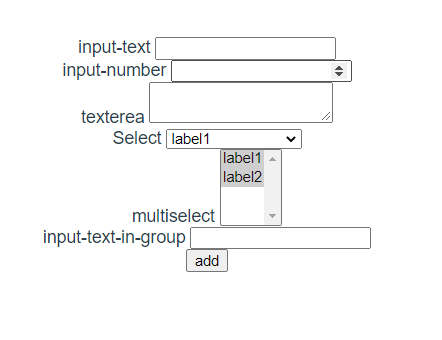

# Formvuelator

Form generator created in vite and vue 3.

After long way of using many form generation tools for vue, I decided to make one by myself.
I plan to provide this features in this library:
- nested collections
- many field events (blur, change, etc)
- provided data model autocompletion/automatic creation (dont know how to call it)

This is my first vue library project, so I look for suggestions and help.
Currently lib is working only in vite vue 3 app (not tested other variants).

More details about schema structure and other things later...

Some example schema:
```javascript
     [
    {
        model: 'field',
        type: 'input',
        subtype: 'text',
        label: 'input-text'
    },
    {
        model: 'fieldnumber',
        type: 'input',
        subtype: 'number',
        label: 'input-number'
    },
    {
        model: 'fieldtextarea',
        type: 'textarea',
        subtype: 'number',
        label: 'texterea'
    },
    {
        model: 'select',
        name: 'seledasdasdctfield',
        type: 'select',
        label: 'Select',
        options: [
            {label: 'label1', value: 1},
            {label: 'label2', value: 2}
        ],
        multiple: false,
    },
    {
        model: 'selectmulti',
        name: 'selectmulti',
        type: 'select',
        label: 'multiselect',
        multipleAsObjects: true,
        optionValueKey: 'tr',
        options: [{label: 'label1', tr: 1}, {label: 'label2', tr: 2}],
        multiple: true,
    },
    {
        type: 'group',
        model: 'group1',
        items: [
            {
                label: 'input-text-in-group',
                model: 'field',
                type: 'input',
                subtype: 'text'
            }
        ]
    }
]
```

Results in:


